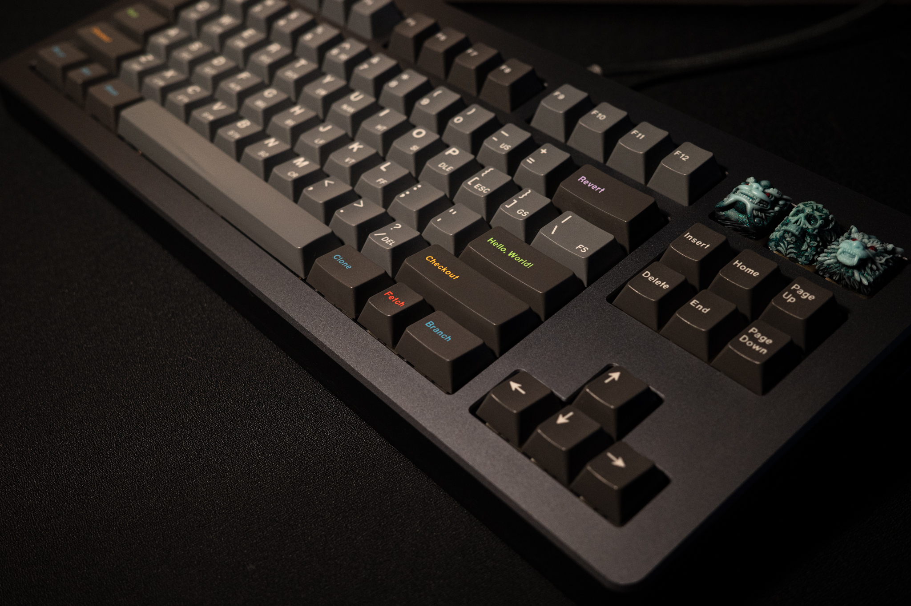

# Keyboard Layouts ⌨️

Log of some of my keyboard builds and backups of their QMK/VIA keyboard layouts. 

- [VIA](https://usevia.app/) 
- [QMK](https://github.com/qmk/qmk_firmware/blob/master/docs/newbs_flashing.md)

---

## QwertyKeys Neo Ergo
| Part        | Description                         | Notes                                                        |
|-------------|-------------------------------------|--------------------------------------------------------------|
| Case        | Neo Ergo                            | Retro White                                                  |
| Switches    | Gateron Oil Kings                   | Krytox 205G0 (stems), GPL 105 (springs), Durock switch films |
| Keycaps     | GMK Beta JS                         | GMK Froyo Spacebar Kit, GMK Dualshot Macros Kit              |
| Artisans    | -                                   | -                                                            |

## RAMAWORKS U80-A
| Part        | Description                                      | Notes                                                          |
|-------------|--------------------------------------------------|----------------------------------------------------------------|
| Case        | RAMAWORKS U80-A                                  | MOON STEALTH                                                   |
| Switches    | Gazzew U4 Boba                                   | Krytox GPL 204 (stems), Krytox 1514 (springs), TX switch films |
| Keycaps     | GMK Oblivion Git                                 | -                                                              |
| Artisans    | Keyforge Shishi, Mulder V3, Orochi (Blue Diesel) | -                                                              |

## CannonKeys Satisfaction 75
| Part        | Description                                                                      | Notes                                                          |
|-------------|----------------------------------------------------------------------------------|----------------------------------------------------------------|
| Case        | CannonKeys Satisfaction 75                                                       | Stormy Grey                                                    |
| Switches    | Tealios V2                                                                       | Tribosys 3204 (stems), Sprit 72g springs, TX switch films      |
| Keycaps     | MOD Keyboards Classic Black PBT                                                  | -                                                              |
| Artisans    | RAMA PVD Brass Knob, GTB Crux Caps (Boulder Series), Keyforge Shishi (Apostasy)  | -                                                              |

