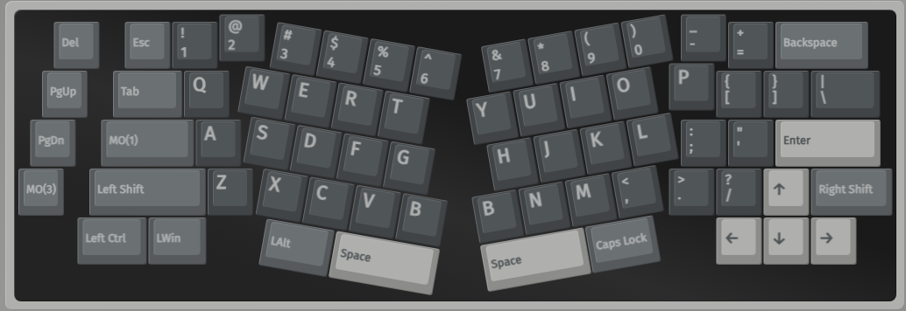
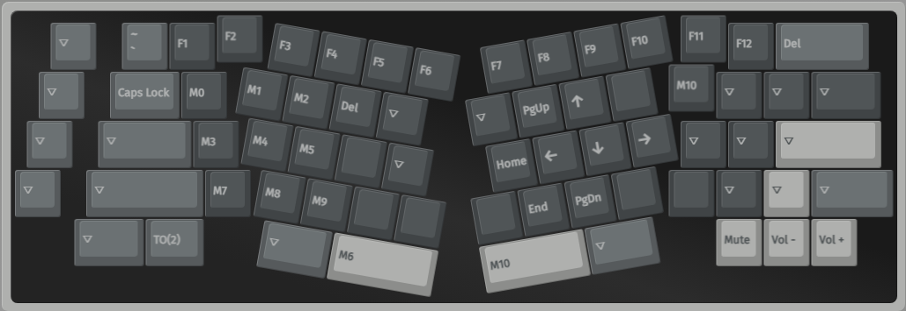
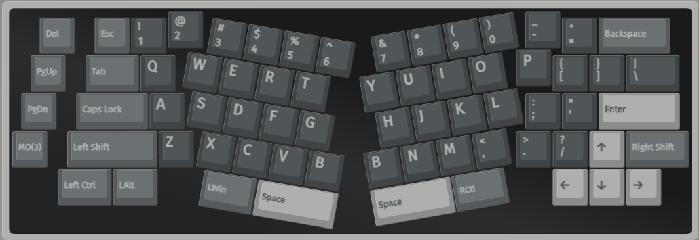
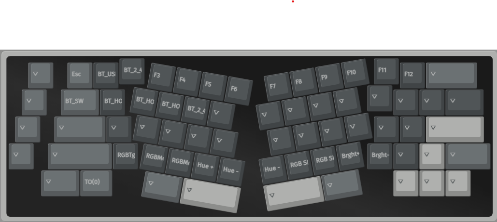

# QwertyKeys Neo Ergo

### Macros

These macros are used along with BTT ([BetterTouchTool](https://folivora.ai/)) to perform certain actions.

| Macro Id | Macro Combo                         | Action                                              | OS   |
|----------|-------------------------------------|-----------------------------------------------------|------|
| M0       | `{KC_LCTL,KC_LALT,KC_LEFT}`         | Maximize Window Left Half (BTT)                     | OSX  |
| M1       | `{KC_LCTL,KC_LALT,KC_UP}`           | Maximize Window (BTT)                               | OSX  |
| M2       | `{KC_LCTL,KC_LALT,KC_RGHT}`         | Maximize Window Right Half (BTT)                    | OSX  |
| M3       | `{KC_LGUI,KC_LEFT}`                 | Maximize Window Left Half                           | WIN  |
| M4       | `{KC_LCTL,KC_LALT,KC_LGUI,KC_LEFT}` | Move Window to Next Monitor (BTT)                   | WIN  |
| M5       | `{KC_LGUI,KC_RGHT}`                 | Maximize Window Right Half                          | WIN  |
| M6       | `{KC_LCTL,KC_LGUI,KC_LSFT,KC_4}`    | Take a screenshot                                   | OSX  |
| M7       | `{KC_LALT,KC_LGUI,KC_8}`            | Magnify Tool (Enable in Accessibility settings)     | OSX  |
| M8       | `{KC_LALT,KC_LGUI,KC_MINS}`         | Decrease zoom                                       | OSX  |
| M9       | `{KC_LALT,KC_LGUI,KC_EQL}`          | Increase zoom                                       | OSX  |
| M10      | `{KC_LGUI,KC_LSFT,KC_S}`            | Take a screenshot                                   | WIN  |

#### Layer 0

#### Layer 1

#### Layer 2

#### Layer 3

