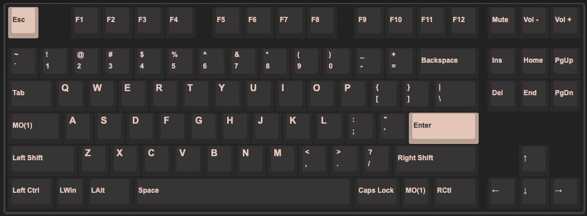
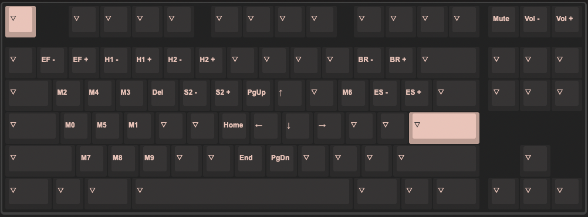

# RAMA u80a

### Macros

These macros are used along with [BetterTouchTool](https://folivora.ai/) to perform certain actions.

| Macro Id | Macro Combo                         | BetterTouchTools Action |
|---|-------------------------------------|---|
| M0 | `{KC_LGUI,KC_LEFT}`                 | (Windows, Non-BetterTouchTool) Maximize Window Left Half |
| M1 | `{KC_LGUI,KC_RGHT}`                 | (Windows, Non-BetterTouchTool) Maximize Window Right Half |
| M2 | `{KC_LCTL,KC_LALT,KC_LEFT}`         | Maximize Window Left Half |
| M3 | `{KC_LCTL,KC_LALT,KC_RGHT}`         | Maximize Window Right Half |
| M4 | `{KC_LCTL,KC_LALT,KC_UP}`           | Maximize Window |
| M5 | `{KC_LCTL,KC_LALT,KC_LGUI,KC_LEFT}` | Move Window to Next Monitor |

#### Layer 0

#### Layer 1

